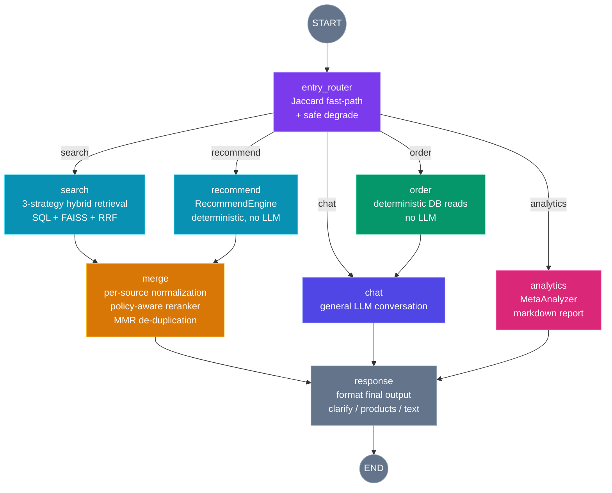

# ShopEase — Multi-Agent E-Commerce System powered by LangGraph

<p align="center">
  
  
  
  
  
  
</p>

A LangGraph-powered multi-agent e-commerce system where AI handles product discovery, cart management, order tracking, and purchase flow — all through natural conversation. JWT authentication, order lifecycle management, inventory tracking, and unified audit logging.

## Architecture

### Agent Graph (LangGraph StateGraph)



### Graph Design

- **entry_router** — Two-tier intent classifier. Jaccard token similarity for fast-path matching; low-confidence queries safely degrade to "chat" rather than making unnecessary LLM calls. Also handles preset intents, ConstraintParser overrides, and session memory for multi-turn follow-ups.

- **search + recommend** — Parallel fan-out. Both nodes execute independently:
  - **search**: 3-strategy hybrid retrieval (SQL_ONLY / SEMANTIC / HYBRID), using FAISS vector search with RRF fusion
  - **recommend**: Delegates to RecommendEngine for collaborative filtering + category matching

- **merge** — Policy-Aware Reranker. Normalizes scores from disparate sources (SQL raw scores, FAISS similarity, CF scores) within their own spaces before fusion. Intent-aware merge policies with MMR de-duplication for diverse results.

- **order** — Fully deterministic. No LLM calls — pure DB reads and structured output. Routes through **chat_node** for natural language wrapping.

- **analytics** — Generates structured markdown reports via MetaAnalyzer. Routes directly to response (no chat wrapping needed).

- **chat** — General-purpose LLM fallback. Handles greetings, help, and any unclassified queries.

### Routing Logic (entry_router)

```
User Query
    │
    ├─ P1: State Router preset? (control_context.preset_intent) → route
    ├─ P2: ConstraintParser override? (search_plan) → route
    ├─ P3: Session memory pending? (multi-turn follow-up) → route
    │
    └─ Fast-path: Jaccard token similarity + keyword boosting
         │
         ├─ confidence ≥ threshold (default 0.85) → route
         └─ confidence < threshold → safe degrade to "chat"
```

The entry_router is an **executor**, not a decision-maker. It runs deterministic classification first; when uncertain, it defaults to "chat" rather than escalating to LLM. This keeps latency low and routing predictable.

## Tech Stack

| Layer | Technology |
|---|---|
| Frontend | Django Templates, vanilla JS |
| Backend | Django 5.2, Django REST Framework, SimpleJWT |
| AI Agent | LangGraph (StateGraph), DeepSeek API |
| Vector Search | FAISS, sentence-transformers |
| Database | MySQL 8.4 |
| Containerization | Docker Compose |
| Auth | JWT (access + refresh token) |

## Features

- **Multi-agent architecture** — 8-node LangGraph StateGraph: entry_router, search, recommend, merge, order, analytics, chat, response
- **Dual-path retrieval** — search (SQL + FAISS hybrid) and recommend (CF) execute in parallel, unified by policy-aware merge
- **Deterministic pathways** — order node runs with zero LLM calls; entry_router degrades safely without LLM escalation
- **Multi-role system** — Admin, Seller, and Customer with granular permissions
- **Product catalog** — Two-level category hierarchy, search, inventory management with transaction ledger
- **Order lifecycle** — Cart → Checkout → Order (paid → shipped → completed) → Refund state machine
- **Audit logging** — Full operation traceability across all modules
- **Shop social** — Follow/unfollow shops, product reviews
- **Dockerized** — `docker compose up` runs the full stack with zero local dependencies

## Quick Start

### Prerequisites

**Docker Desktop only.** Download from https://www.docker.com/products/docker-desktop

### Launch

```bash
docker compose up
```

On first run, allow 2–3 minutes for MySQL to import the pre-loaded database. Once complete:

```
backend-1   | Django version 5.2, using settings 'mysite.settings'
frontend-1  | Local:  http://localhost:5173/
```

| Service | URL |
|---|---|
| Frontend | http://localhost:5173 |
| Backend API | http://localhost:8000 |
| MySQL | localhost:3306 (root / shopeease123) |

### Live Reload

All source code is mounted into containers with hot-reload enabled:

- **Backend**: Python files saved → Django auto-restarts
- **Frontend**: React/TypeScript files saved → browser updates instantly via HMR
- **Database**: accessible at `localhost:3306` with any MySQL client (Workbench, DBeaver, CLI)

## Project Structure

```
├── backend/                # Django REST API
│   ├── agents/             # LangGraph AI Agent (multi-agent orchestration)
│   │   ├── graph/          # StateGraph definition + nodes
│   │   │   ├── graph_builder.py   # Compiled graph singleton
│   │   │   ├── state.py           # AgentState (SSOT)
│   │   │   ├── nodes/             # 9 graph nodes
│   │   │   │   ├── entry_router.py  # 368 lines — two-tier classifier
│   │   │   │   ├── search_node.py   # 311 lines — hybrid retrieval
│   │   │   │   ├── recommend_node.py # 277 lines — CF engine
│   │   │   │   ├── merge_node.py    # 404 lines — policy reranker
│   │   │   ├── order_node.py    # 73 lines — deterministic
│   │   │   ├── analytics_node.py # 43 lines — report gen
│   │   │   │   ├── chat_node.py     # 96 lines — LLM fallback
│   │   │   │   └── response_node.py # 63 lines — output formatting
│   │   │   └── contracts/    # Typed I/O contracts per node
│   │   ├── core/             # LLM client, tool registry
│   │   ├── commerce/         # RecommendEngine, search utilities
│   │   ├── meta/             # MetaAnalyzer (analytics)
│   │   └── api/              # Agent API views
│   ├── users/                # User model, JWT auth, profile
│   ├── products/             # Product, Category, Shop, Inventory, Review
│   ├── orders/               # Order, OrderItem, Cart, Refund
│   └── admin_api/            # Admin dashboard, audit logs
├── frontend/                 # Django Templates + vanilla JS
│   └── templates/
│       ├── ai/               # AI Workspace chat interface
│       └── users/            # Login, Register pages
├── docker/mysql/init/        # Database dump (auto-imported on first launch)
├── docker-compose.yml        # Service orchestration
└── .env                      # Environment configuration
```

## Demo Accounts

| Role | Username | Password |
|---|---|---|
| Admin | admin | admin123 |
| Customer | c00001 | gi6AWCRM7fLh |
| Seller | s00001 | pZ9R9a%jcqhW |
| CSV Admin | a00001 | HF2z8n#xytDp |

## Running Without Docker

If Docker is not available, install the following and run each service manually:

### Prerequisites

- Python 3.11+
- MySQL 8.4

### Setup

```bash
# 1. Clone & install dependencies
cd backend
python -m venv .venv
source .venv/bin/activate  # Windows: .venv\Scripts\activate
pip install -r requirements.txt

# 2. Configure environment
cp .env.example .env
# Edit .env — set DB_PASSWORD, DEEPSEEK_API_KEY

# 3. Run
python manage.py runserver 0.0.0.0:8000
```

Then open http://127.0.0.1:8000/

### Database

Import the pre-loaded SQL dump into your local MySQL instance:

```bash
mysql -u root -p < docker/mysql/init/01_dump.sql
```
